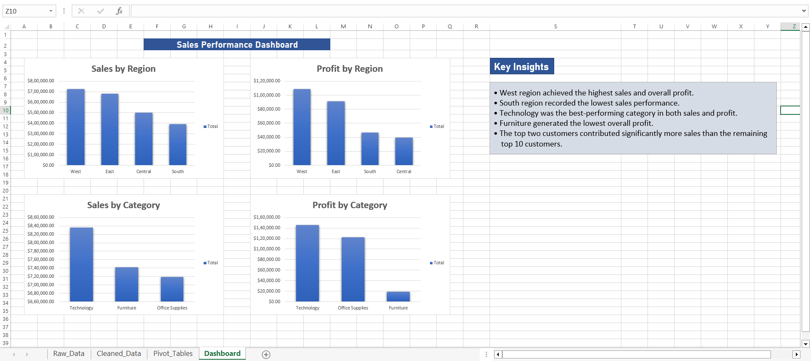
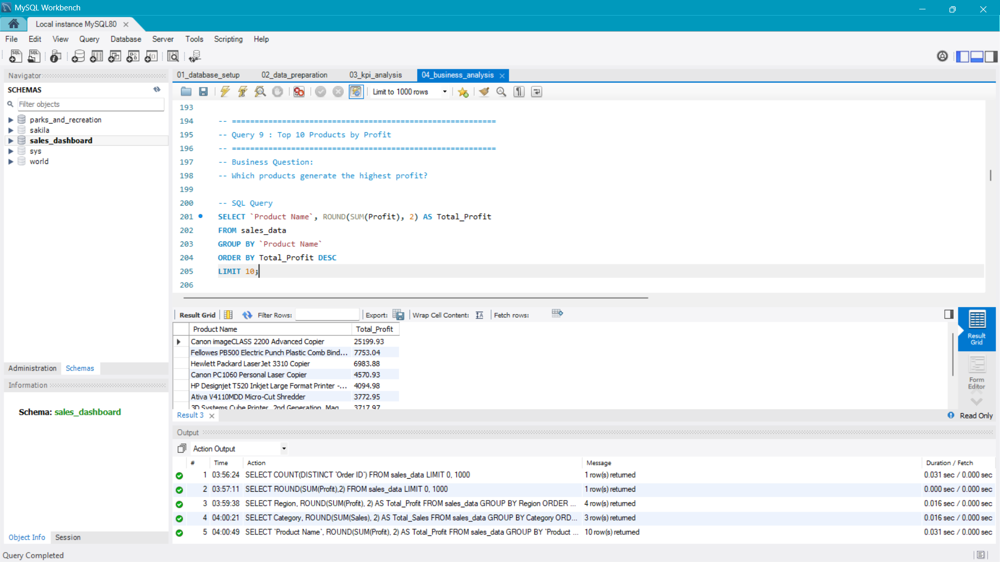
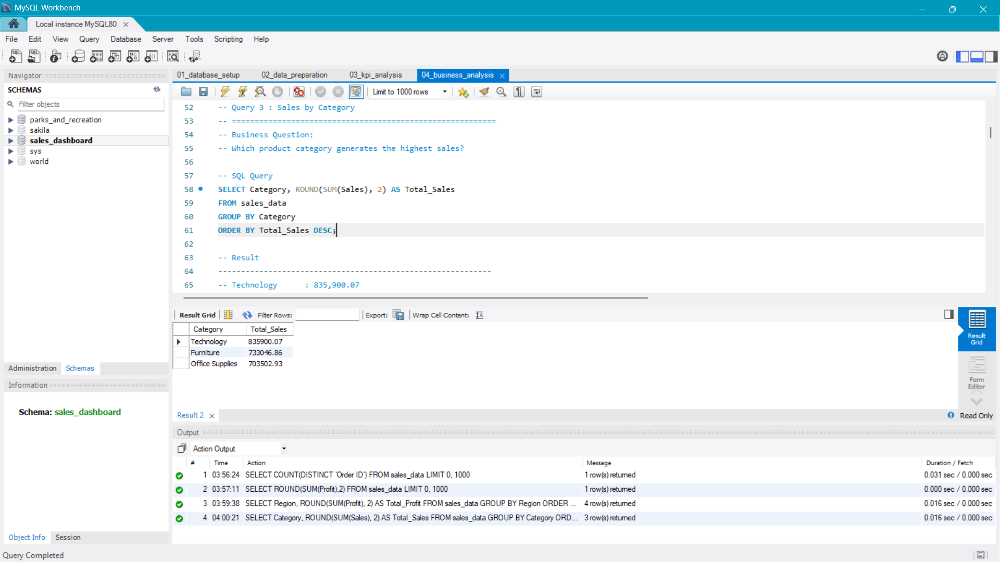
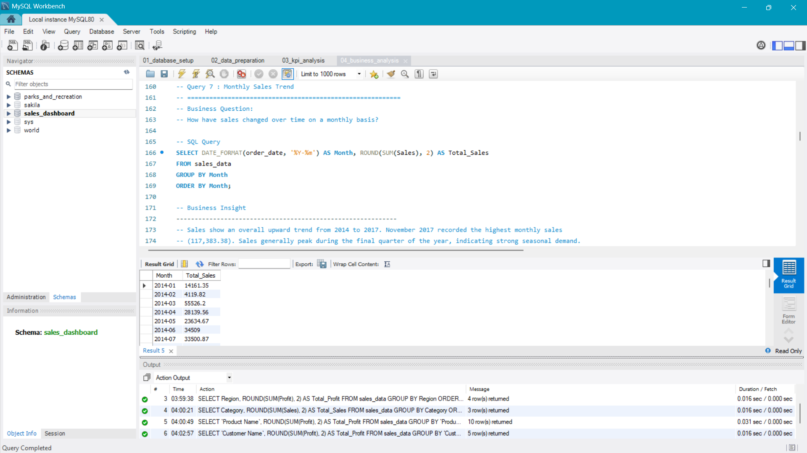
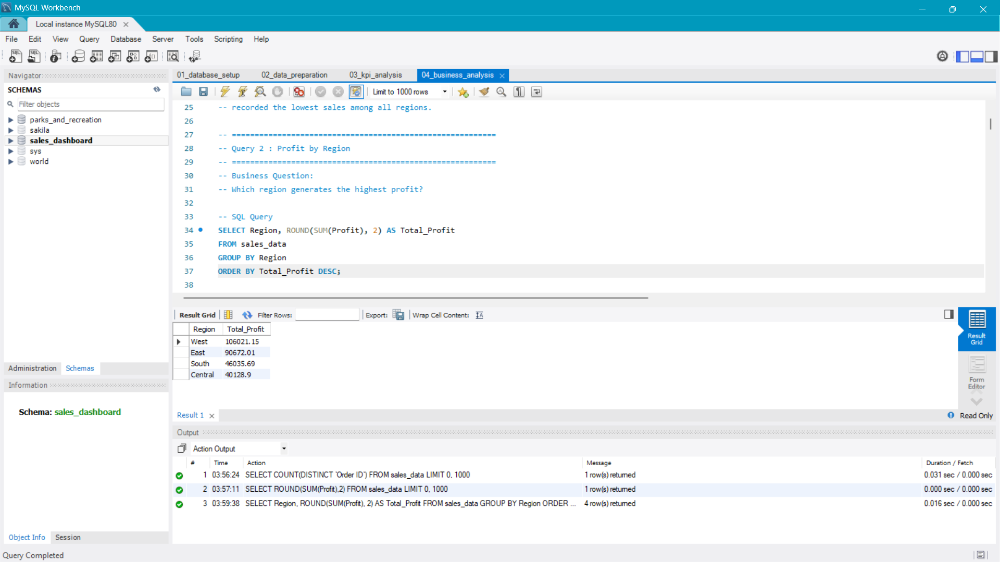
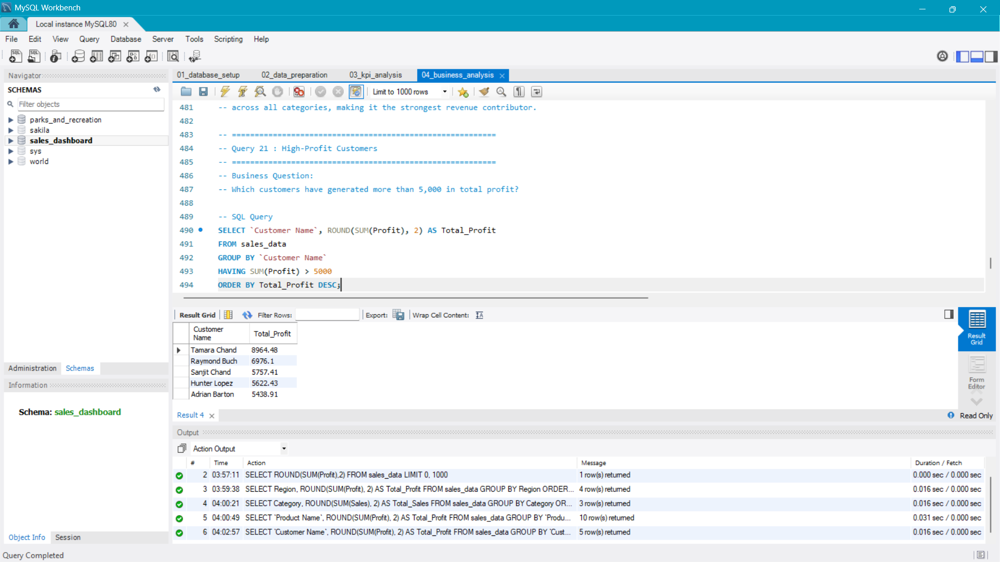

# Sales Performance Analytics with SQL & Excel Dashboard

An end-to-end data analytics project that analyzes sales performance using **MySQL** and presents key business insights through an **interactive Excel dashboard**.

The project demonstrates the complete analytics workflow—from data preparation and SQL-based business analysis to dashboard visualization using the **Sample Superstore** dataset.

---

## Project Overview

The objective of this project is to analyze sales data to identify trends, evaluate business performance, and generate actionable insights.

Using SQL, the dataset was cleaned, validated, and analyzed through KPI and business-focused queries. The results were then visualized using an interactive Excel dashboard.

---

## 🛠️ Tools & Technologies

- **MySQL**
- **SQL**
- **Microsoft Excel**
- Pivot Tables
- Pivot Charts
- Slicers
- Git & GitHub

---

## 📂 Repository Structure

```
Sales-Performance-Analytics/
│
├── Dataset/
│   └── Sample-Superstore.csv
│
├── SQL/
│   ├── 01_database_setup.sql
│   ├── 02_data_preparation.sql
│   ├── 03_kpi_analysis.sql
│   └── 04_business_analysis.sql
│
├── Excel/
│   └── Sales Performance Dashboard.xlsx
│
├── Images/
│   ├── dashboard.png
│   ├── query1.png
│   ├── query2.png
│   └── ...
│
└── README.md
```

---

## Project Workflow

1. Imported the dataset into MySQL.
2. Prepared the data by converting date fields and validating data integrity.
3. Performed KPI analysis to measure business performance.
4. Executed business analysis queries to uncover trends and opportunities.
5. Built an interactive Excel dashboard to visualize the findings.

---

## 📊 KPI Analysis

The project includes SQL queries to calculate:

- Total Sales
- Total Profit
- Total Orders
- Total Records
- Average Order Value

---

## 📌 Business Analysis

The analysis answers questions such as:

- Which region generates the highest sales?
- Which region is the most profitable?
- Which product categories perform best?
- Which customers contribute the highest sales and profit?
- Monthly and yearly sales trends
- Quarterly sales performance
- Sales and profit by segment
- Sales and profit by sub-category
- Average shipping time by ship mode and region
- Discount impact on profitability
- High-profit customers
- Top-performing states

A total of **22 business analysis queries** were executed.

---

## Dashboard Preview

### Excel Dashboard



---

## SQL Query Outputs

### Total Profit by Product



### Total Sales by Category



### Monthly Sales Trend



### Total Profit by Region



### Customers with more than 5k contribution in Total Profit



---

## Key Insights

- West region generated the highest sales.
- California and New York were the most profitable states.
- Technology was the highest-performing category by both sales and profit.
- Tables generated significant losses despite strong sales.
- Higher discounts (above 20%) negatively impacted profitability.
- Sales consistently peaked during the fourth quarter of each year.

---

## How to Use

1. Import the dataset into MySQL.
2. Execute the SQL files in order:
   - 01_database_setup.sql
   - 02_data_preparation.sql
   - 03_kpi_analysis.sql
   - 04_business_analysis.sql
3. Open the Excel dashboard to explore the visualizations.

---

## Dataset

**Dataset:** Sample Superstore Dataset
**Source:** https://www.kaggle.com/datasets/vivek468/superstore-dataset-final

---

## 👤 Author

**Utkarsh Kumar Yadubanshi**

GitHub: https://github.com/Utkarsh-Yadav-0000
